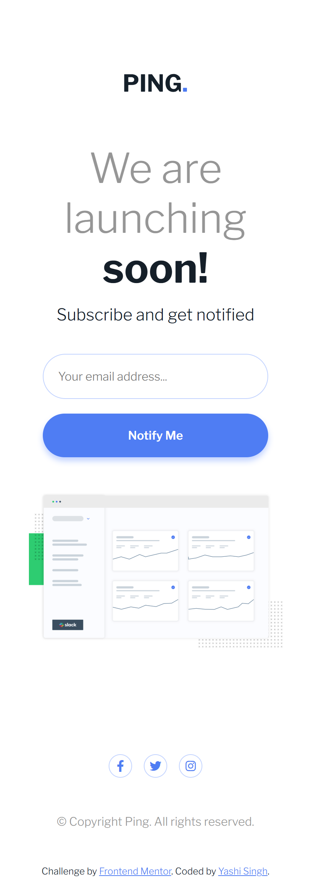

# Frontend Mentor - Ping Coming Soon Page Solution

This is a solution to the [Ping coming soon page challenge on Frontend Mentor](https://www.frontendmentor.io/challenges/ping-single-column-coming-soon-page-5cadd051fec04111f7b848da). Frontend Mentor challenges help you improve your coding skills by building realistic projects.

## Table of contents

- [Overview](#overview)
  - [The challenge](#the-challenge)
  - [Screenshot](#screenshot)
  - [Links](#links)
- [My process](#my-process)
  - [Built with](#built-with)
  - [What I learned](#what-i-learned)
  - [Continued development](#continued-development)
  - [Useful resources](#useful-resources)
- [Author](#author)
- [Acknowledgments](#acknowledgments)

## Overview

### The challenge

Users should be able to:

- View the optimal layout for the site depending on their device's screen size
- See hover states for all interactive elements on the page
- Submit their email address using an `input` field
- Receive an error message when the `form` is submitted if:
  - The `input` field is empty. The message for this error should say *"Whoops! It looks like you forgot to add your email"*
  - The email address is not formatted correctly (i.e. a correct email address should have this structure: `name@host.tld`). The message for this error should say *"Please provide a valid email address"*

### Screenshot

**Desktop Design**


**Mobile Design**



### Links

- Solution URL: [Add solution URL here](https://your-solution-url.com)
- Live Site URL: [Add live site URL here](https://your-live-site-url.com)

## My process

### Built with

- Semantic HTML5 markup
- SASS for styling
- Flexbox
- JavaScript for form validation and user interaction
- Mobile-first design approach

### What I learned

While working on this project, I learned several important concepts in HTML, CSS, and JavaScript:

- **Form Validation:** I created a simple form validation system using JavaScript to check for empty fields and validate email addresses with a regular expression.
  
```javascript
const emailRegex = /^[a-zA-Z0-9._-]+@[a-zA-Z0-9.-]+\.[a-zA-Z]{2,6}$/;
```

- **Mobile-first design:** The page is designed to look great on both desktop and mobile devices, adjusting its layout based on the screen size using Flexbox.
  
- **SASS:** I used SASS for more maintainable and scalable styles, utilizing variables and nesting for better organization of the CSS.

```scss
$blue: hsl(223, 87%, 63%);
$pale-blue: hsl(223, 100%, 88%);
$light-red: hsl(354, 100%, 66%);
```

### Continued development

In future projects, I aim to refine my skills in JavaScript validation and handling user interactions, such as integrating email subscriptions with a backend system. Additionally, I would like to improve my understanding of responsive design by experimenting with CSS Grid in addition to Flexbox.

### Useful resources

- [MDN Web Docs: Regular Expressions](https://developer.mozilla.org/en-US/docs/Web/JavaScript/Guide/Regular_Expressions) - A great resource to understand and work with regular expressions for form validation.
- [Sass Guide](https://sass-lang.com/guide) - This helped me understand how to use Sass for efficient and organized styling.

## Author

- Website - [Yashi Singh](https://www.your-site.com)
- Frontend Mentor - [@yourusername](https://www.frontendmentor.io/profile/yourusername)
- Twitter - [@yourusername](https://www.twitter.com/yourusername)

## Acknowledgments

Thanks to Frontend Mentor for providing this challenge. It helped me practice and improve my skills in front-end development, including form validation, responsive design, and SASS.

---

### **SASS Setup and Installation**

To work with this project using SASS, follow these steps to set up SASS in your development environment.

#### 1. **Install Node.js and NPM**

If you haven't already, install Node.js and NPM (Node Package Manager) on your machine.

- Download and install from [Node.js official website](https://nodejs.org/).

#### 2. **Install SASS via NPM**

Once you have Node.js and NPM installed, open your terminal and navigate to the project folder.

Then run the following command to install SASS:

```bash
npm install sass --save-dev
```

This will install SASS as a development dependency in your project.

#### 3. **SASS Compilation**

To compile your SASS into regular CSS, you need to run the following command in your project folder:

```bash
npx sass --watch src/scss:dist/css
```

- `src/scss` is the folder where your `.scss` files are located.
- `dist/css` is the folder where the compiled `.css` files will be saved.

#### 4. **Folder Structure**

Ensure your project structure looks like this:

```
/ping-coming-soon-page
  /dist
    /css
      style.css
  /src
    /scss
      style.scss
  index.html
  README.md
```

#### 5. **Customizing and Using SASS**

In the `src/scss/style.scss` file, you can use SASS features like variables, nesting, and mixins for more maintainable and scalable CSS.

For example, use variables for color definitions:

```scss
$primary-color: #4caf50;

body {
  background-color: $primary-color;
}
```

This way, whenever you need to update the color, you only need to change it in one place.

---

By following these steps, you can compile SASS into CSS and work with it to develop your project.